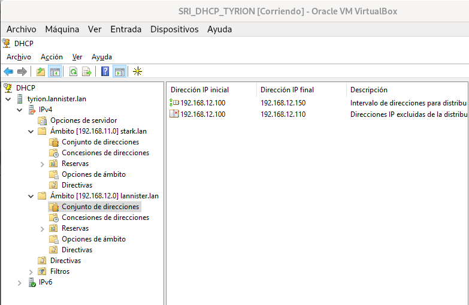

# Servidores DHCP Windows

### 1. Un ámbito para os equipos da rede privada lanister, con un intervalo de exclusión.
### 2. Deberás crear unha reserva estática que estará no rango de enderezos do seu ámbito correspondente.
### 3. Establece os nomes de dominio e servidores DNS primario de cada zona.
### 4. Deberás actualizar a zona primaria no servidor DNS tywin.
### 5. Engade outro ámbito para a rede primaria stark (necesitas outra interface de rede) que actualice a zona prinaria DNS definida no equipo arya.
### 6. Instala no equipo jaime un servizo DHCP failover para a subrede lanister.
### 7. Necesitarás polo menos tres clientes (Cercei,Joffrey, Myrcella) para a rede lannister e un para a  rede stark (jon). Inclúe capturas de:
- Configuración dos ambitos e rangos de enderezos

- Configuración de opcións

- Configuración da actualización

- Vídeo no que o cliente renova a concesión, e se ve  a zona DNS unha vez que o DHCP actualiza o DNS. Tamén o cliente debe ser capaz de resolver o seu propio nome (non FQDN).

- Clientes das dúas subredes, amosando DNS, router e enderezo IP.

- Configuración dos servidores failover

- Capturas dos clientes obtendo enderezos cos dous servidores failover encendidos, e con un acendido e outro apagado (de forma alterna)

### 9. Elimina a interface de rede 192.168.11.8 de tyrion, e configura o servizo DHCP Relay no router. Comproba que os equipos da rede stark.lan reciben a configuración de rede de xeito correcto. Inclúe as capturas necesarias.

